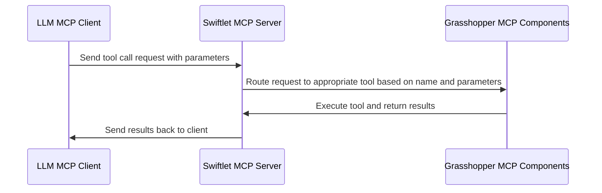

# AIA26 Studio README

## GitHub repository structure and guidelines

Each team has a folder: `team_01`, `team_02`, … `team_06`. Inside **your** folder you will find:

- **`gh/`** — two Grasshopper cluster files (MCP tool **definitions** and **results**) plus a **working test** Grasshopper file (`.gh`) wired to run the Swiftlet MCP server for that team’s tools.
- **`python/`** — a small starter agent (LangGraph + MCP over HTTP) you extend for the studio project.

Work only in **your team’s branch** and **your team’s folder**. Do not edit other teams’ files. You may add files inside your team folder as needed. Shared changes for everyone should be coordinated with the instructors.

| Rule | Why |
|------|-----|
| One branch per team | Keeps merges predictable. |
| Edits only under `team_XX/` | Avoids conflicts until the final integration. |
| Weekly PR into `main` | Instructors review; PRs with changes outside your folder may be rejected. |

**Weekly pull request:** One PR per team per week into `main`, **Sunday 11:59 PM Barcelona time**. Instructors merge after review. Tools and agents are not graded every week; a fuller evaluation happens later, but following this structure keeps the project integrable.

- [Managing branches in GitHub Desktop](https://docs.github.com/en/desktop/making-changes-in-a-branch/managing-branches-in-github-desktop)
- [Creating a pull request from GitHub Desktop](https://docs.github.com/en/desktop/working-with-your-remote-repository-on-github-or-github-enterprise/creating-an-issue-or-pull-request-from-github-desktop)

### `team_base` directory

`team_base` holds an **older reference Python layout** (different graph shape than the current `team_XX/python` tree). It does **not** contain Grasshopper `.gh` / `.ghcluster` files. Your Grasshopper starting files live under **`team_XX/gh/`** in your team folder.

### Combined “all teams” Grasshopper (end of studio)

A single Grasshopper setup that exposes **every** team’s tools may be added later for final integration testing. Until instructors provide that, develop and test inside **your** `team_XX/gh/` definition only.

### Coordination with other teams

Avoid duplicating another team’s tool. Talk to other teams so the final toolbox is complementary and works well together.

---

## Grasshopper MCP tools

The shared goal is one repository where many MCP tools exist so agents can call tools built by different teams.

### Team files (paths that matter)

Clusters and the working definition sit under **`team_XX/gh/`**, not in a repo-wide `gh/` folder.

**Example for team 1:**

- `team_01/gh/team_01_definition_cluster.ghcluster`
- `team_01/gh/team_01_result_cluster.ghcluster`
- `team_01/gh/team_01_working.gh` — test harness and Swiftlet wiring; **use it to run and test your clusters, but do not rework this file** unless instructors say otherwise. Prefer editing the clusters. For help, ask the instructors (Scott is a good contact for Grasshopper/MCP).

New copies of teams may still use `team_01_*` filenames until you replace them with your own assets.

### Working with the Swiftlet clusters

#### MCP tool definition

Follow the official docs: [Swiftlet MCP node documentation](https://github.com/enmerk4r/Swiftlet/wiki/MCP). Below is a short reminder; use the wiki for full detail.

###### Parameter definition

Each parameter needs a **Name**, **Type**, **Description**, and **Required** flag.


###### Tool definition

Each tool needs a **Name** (no spaces), **Description** (helps the LLM choose and use the tool), and **inputs** with clear types and descriptions.


#### MCP results (routing)

Definition and result clusters must stay in sync: **tool names** in the definition cluster must match the list used in the result cluster, and **order** in the result cluster must match how calls are routed (same order as the logic branches). The working `.gh` includes tree panels to compare names side by side.


Name **outputs** clearly so they align with what you promised in the tool description. Connect the **OK** output of the Tool Response node to the **Gate Or** input in the result cluster so successful calls log correctly in the Data Recorder.

### Running the Swiftlet server

Grasshopper’s MCP Server component talks to a separate **Swiftlet** process (on Windows this is typically a `.exe`). The client (LM Studio, Claude Desktop, or the Python agent) sends tool calls to Swiftlet; Swiftlet runs the matching logic in Grasshopper and returns the result.



#### Finding a free port

The working definitions include a **C# script** that picks the first free port in a range (default **3001–3100**) and feeds the MCP Server. Check the panel for the chosen port and use **that** port in your client’s `mcp.json` (or your duplicate port entries). You can change `startPort` / `endPort` in the script if needed.

### Testing with LM Studio or Claude Desktop

Point your MCP client at the **same host and port** Swiftlet is using (from Grasshopper / the free-port panel). Use **Grasshopper → right-click MCP Server → “Copy MCP Config”** to build or update the server block for `mcp.json`.

If you paste a full new config over an existing `mcp.json`, you can wipe other servers—**merge by hand** or ask instructors for help.

###### Predefining ports in `mcp.json`

`mcp.json` needs a fixed URL including the port. If the free-port script picks a different port each run, either update `mcp.json` to match or keep a few duplicate entries (e.g. 3001, 3002, 3003) and enable the one that matches today’s panel output (exact ports vary by machine).


### LM Studio

LM Studio can run **local** models or connect to remote APIs. It is **only for testing** how your Grasshopper tools behave with an LLM—not the final studio “engine.” It can also target OpenAI-compatible endpoints (e.g. Cloudflare). Ask instructors if you want help wiring it to Swiftlet.

### Claude Desktop

Same idea: connect to Swiftlet, call tools, debug workflows—**testing only**, not the final engine.

### Package management (Grasshopper)

Use extra Grasshopper plugins only when necessary, document **name + version**, and verify compatibility with Swiftlet MCP on your machine. The instruction team cannot test every combination.

---

## Python agent (LangGraph + MCP)

Each team uses **`team_01` … `team_06`** with the same layout. Code lives in **`team_XX/python/`**: a small loop (**reason** → **tool** → **reason**) over HTTP JSON-RPC MCP, with shared sample layout JSON as context.

The code is **fail-fast** by design: no automatic retries or recovery layer.

### What you need installed

- **Rhino + Grasshopper** (with **Swiftlet** installed as required for the course).
- **Python 3.10+** on your PATH (the project uses modern type syntax).
- A terminal and **Git** (or GitHub Desktop).

### Quick start (first time)

Do these in order:

1. **Clone** the repo and checkout **your team’s branch**.
2. At the **repository root**, copy **`mcp.example.json`** to **`mcp.json`** and edit the Swiftlet URL/port to match your machine (or use “Copy MCP Config” from Grasshopper after the steps below).
3. Copy **`.env.example`** to **`.env`** at the repo root and fill in **`LLM_PROVIDER`** and the variables for that provider (see below).
4. **Open Rhino**, open your team’s **`team_XX/gh/team_XX_working.gh`**, and run the definition so Swiftlet is listening on the expected port.
5. Create a **virtual environment** (recommended), **activate** it, then from the repo root run **`pip install -r requirements.txt`**.
6. In a terminal: **`cd team_XX/python`** (your team) and run **`python main.py "your instruction here"`**.

If `main.py` cannot reach the MCP server, confirm Grasshopper is running and `mcp.json` points at the correct HTTP endpoint.

### Per-team directory layout

Replace `team_01` with your folder (`team_02`, …).


Edited Layout JSON: 
{
    "layoutId": "Layout-101",
    
    "outline": [[0.0, 0.0], [9.0, 0.0], [9.0, 5.0], [0.0, 5.0], [0.0, 0.0]],
  
    "rooms": [
      {
        "id": "room-1",
        "name": "Living Room",
        "geometry": [[0.0, 0.0], [5.0, 0.0], [5.0, 5.0], [0.0, 5.0], [0.0, 0.0]],
        "attributes": {
          "area": 25.0
        }
      },
      {
        "id": "room-2",
        "name": "Bedroom 1",
        "geometry": [[5.0, 0.0], [9.0, 0.0], [9.0, 5.0], [5.0, 5.0], [5.0, 0.0]],
        "attributes": {
          "area": 20.0
        }
      }
    ],
  
    "doors": [
      {
        "id": "door-1",
        "type": "wooden",
        "name": "Bedroom Door",
        "geometry": [[5.0, 2.0], [5.0, 2.9]],
        "attributes": {
          "connectsRooms": ["room-1", "room-2"]
        }
      },
      {
        "id": "door-2",
        "type": "wooden",
        "name": "Living Room Door",
        "geometry": [[5.0, 2.0], [5.0, 2.9]],
        "attributes": {
          "connectsRooms": ["room-1", "room-2"]
        }
      }
    ],
  
    "windows": [
      {
        "id": "window-1",
        "type:":"sliding",
        "name": "Living Room Window",
        "geometry": [[0.0, 2.0], [0.0, 3.5]],
        "attributes": {
          "roomId": "room-1"
        }
      },
      {
        "id": "window-2",
        "type:":"sliding",
        "name": "Living Room South Window",
        "geometry": [[2.0, 0.0], [3.5, 0.0]],
        "attributes": {
          "roomId": "room-1"
        }
      }
    ],
  
    "furniture": [
      {
        "id": "furn-1",
        "name": "Main Couch",
        "geometry": [[2.0, 3.0], [4.0, 3.0], [4.0, 4.0], [2.0, 4.0], [2.0, 3.0]],
        "attributes": {
          "roomId": "room-1"
        }
      }
    ],
  
    "mep": [
      {
        "id": "mep-1",
        "name": "Living Room AC",
        "geometry": [[2.5, 4.5], [3.5, 4.5], [3.5, 4.8], [2.5, 4.8], [2.5, 4.5]],
        "attributes": {
          "system": "hvac"
        }
      },
      {
        "id": "mep-2",
        "name": "Main Breaker Box",
        "geometry": [[0.2, 0.2], [0.8, 0.2], [0.8, 0.5], [0.2, 0.5], [0.2, 0.2]],
        "attributes": {
          "system": "electrical"
        }
      }
    ],
  
    "structure": [
      {
        "id": "wall-1",
        "name": "North Interior Wall",
        "geometry": [[5.0, 0.0], [5.0, 5.0]],
        "attributes": {}
      }
    ]
  }
```

---

## Benchmarking

To help evaluate your agent's performance, we can make an edit to the `llm.py` file to allow different providers and models to be used with each call of the `call_llm` function.  This allows us to use small models for simple tasks and larger models for more complex tasks, and compare the results.

Please refer to the `llm.py` example file added to `./examples/updated_call_llm/llm.py` for an example of how to modify the `call_llm` function to accept a `provider` and `model` argument.  Then whenever you call optionally `call_llm` from a node, you can specify which provider and model to use for that call.  