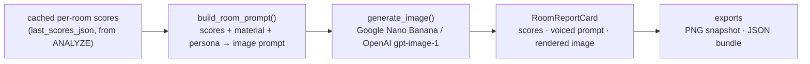

# The Report / Vision pipeline (Act 3)

The Report ("The Vision") is Sensi's **output act**. It turns the comfort analysis a
user has already run into a per-room, score-driven set of generated interior images,
plus a downloadable record of the design.

**It is NOT part of the LangGraph conversation graph.** The graph in
[`sensi_graph.mermaid`](../../python/sensi_graph.mermaid) covers the conversational
turn flow (onboarding → routing → analysis/edits → response). The Report is a **separate
screen** the user navigates to; it calls its own REST endpoints that **never enter
`run_agent`**. What it shares with the graph is *data*: it reads the cached scores the
`analyze` node produced and calls the same in-process comfort tool. In the main diagram
it is therefore drawn as a **post-graph output branch** (like `OUTPUT_WRITER`), not a turn node.

> Note: Sensi does not use MCP. The comfort tool (`compute_comfort_scores`) runs
> in-process via `LocalToolClient`. Image generation is a separate external HTTP API.

---

## The loop: score → prompt → image

The Report makes the analysis *visible*. For each room it renders three linked panes —
**the scores → become a prompt → become an image** — so the connection between a comfort
number and what the space feels like is legible.

Only senses scoring in the **extreme ranges** (below 0.45 or above 0.70) are "voiced" in
the prompt and shown as chips — mid-range senses stay silent. So a room's *weak* senses
set the mood of its render, and discomfort becomes something you can see.

---

## 1. The vision model

[`team_02/python/imaging/client.py`](../../python/imaging/client.py) — `generate_image(prompt, reference_b64=None)`.

Provider is chosen by `IMAGE_PROVIDER` (falls back to `LLM_PROVIDER`), so the two are
A/B-swappable with one `.env` flip:

| Provider | Model (env override) | API |
|----------|----------------------|-----|
| **`google`** (default) | `gemini-2.5-flash-image` ("Nano Banana") — `GOOGLE_IMAGE_MODEL` | REST `generateContent`, `responseModalities: ["IMAGE"]` |
| `openai` | `gpt-image-1`, quality `medium` — `OPENAI_IMAGE_MODEL` / `OPENAI_IMAGE_QUALITY` | `openai` SDK `images.generate` / `images.edit` |

Image generation does **not** go through `_runtime/llm.py` (that's chat only). For
before/after pairs, the "before" render is anchored on the "after" image via
`reference_b64` (Gemini `inlineData` / OpenAI `images.edit`) for visual consistency.

**Benchmark decision:** Google won — ~2.75× faster, slightly cheaper. See
[`docs/week08/image-provider-benchmark.md`](../week08/image-provider-benchmark.md) and the
research in [`docs/week08/image-generation-research.md`](../week08/image-generation-research.md).
Re-run with `python -m imaging.benchmark` from `team_02/python/`.

## 2. The prompts

[`team_02/python/imaging/prompt.py`](../../python/imaging/prompt.py) — `build_room_prompt(room, scores, persona)`.

The prompt is composed deterministically (no LLM call) from:
- **Room grounding** — `roomType` + `floorMaterial` from the layout.
- **Voiced senses** — `_SENSE_FRAGMENTS` maps each sense to a *low* phrase (score < 0.45)
  or *high* phrase (score > 0.70). E.g. low acoustic → "hard reflective surfaces … that
  look acoustically live"; high olfactory → "fresh and well-ventilated, with a few plants".
- **Persona register** — `_REGISTER[role]` sets the photography style (architect →
  "restrained, material-honest architectural photography"; client → "warm, inviting
  lifestyle interior photography"; student → "cosy, practical real-world interior photo").
- Fixed tail: "Natural perspective, 35mm lens, photorealistic, high detail, no text, no people."

The same `_SENSE_FRAGMENTS` strings drive the hover-to-highlight link between a sense chip
and its phrase in the rendered prompt text (`RoomReportCard`).

## 3. How scoring feeds the report

The Report **reuses the cached `last_scores_json`** from the session (produced by the
graph's `analyze` node) — it does **not** re-score. Per-room scores are pulled by
`_room_comfort_scores()`; the dwelling headline uses the same `0.6·mean + 0.4·worst` blend
as the rest of the app.

The **only** place the Report re-scores is the before/after comparison:
- **`POST /api/compare-initial`** — the single source of truth for before/after.
  **before** = the original **on-disk** layout (`_original_layout()`); since edits only
  mutate the in-session string and never the file, this is the layout with *zero* edits.
  **after** = the current (cumulatively edited) session layout. It picks the most-changed
  room, re-scores both states, renders before+after, and returns room + dwelling
  before/after overalls. Powers the dwelling story (`DwellingStory.jsx`).

> There is intentionally **no** "last edit only" compare. The before/after is always
> **initial → now**, never "one edit ago → now". (A former `/api/compare-room` that
> reverted only the last edit was removed to keep one semantic.)

Caches in `_INITIAL_COMPARE_CACHE`, keyed by a SHA1 of provider + layout + room +
attributes + furniture counts; pass `force=true` to bypass.

## 4. Endpoints

[`team_02/python/api/server.py`](../../python/api/server.py):

| Endpoint | Purpose |
|----------|---------|
| `POST /api/report` | Fast metadata: per-room `{comfort_scores, overall_score, prompt}` + `featured[]` (worst + most-recently-edited). **No images yet.** |
| `POST /api/render-room` | Generate (and cache) one room's image from its score-driven prompt. Featured rooms render eagerly; others lazily on expand. |
| `POST /api/compare-initial` | Before/after for the whole session: **initial on-disk → current** (see §3). |
| `POST /api/layout` | Returns the session's **current** `layout_json_string` (post-edit). Used by the viewer and the JSON export. |

## 5. Downloadable output

The Report header ([`ReportHeader.jsx`](../../web/src/report/ReportHeader.jsx)) has two exports:

- **⤓ image** — [`exportReportPng.js`](../../web/src/report/exportReportPng.js): rasterizes the
  live report DOM to `sensi-report-{layoutId}.png` (honest snapshot — ungenerated rooms
  appear as their placeholder).
- **⤓ json** — [`exportBundle.js`](../../web/src/report/exportBundle.js): downloads
  `sensi-report-{layoutId}.json`, a bundle of:
  - `layout` — the **current edited layout** (fetched via `/api/layout`, i.e. the state
    *after* all applied edits). **This is the downloadable "current state of the layout."**
  - `scores`, `conflicts`, `suggestions` — the cached analysis for that layout.
  - `prompts[]` — per-room `{room, room_type, overall_score, comfort_scores, prompt}`.
  - `layoutId`, `exportedAt`.

**Not user-exposed:** the backend also writes `resulting_layout/Layout-{id}_modified.json`
(the layout with analysis metadata baked in) via `output_writer.py`. That file is
server-side only — it is *not* served by any download endpoint. The user-facing
"current edited layout" is the `layout` field of the JSON bundle above.

---

## Frontend map

`team_02/web/src/report/`: `ReportScreen.jsx` (orchestrates `/api/report` + lazy
`/api/render-room`), `RoomReportCard.jsx` (the score→prompt→image card), `DwellingStory.jsx`
(dwelling ripple + compare-initial), `RenderSlot.jsx` (idle/loading/done/error image cell),
`ReportHeader.jsx` (back + exports), `exportReportPng.js`, `exportBundle.js`.
