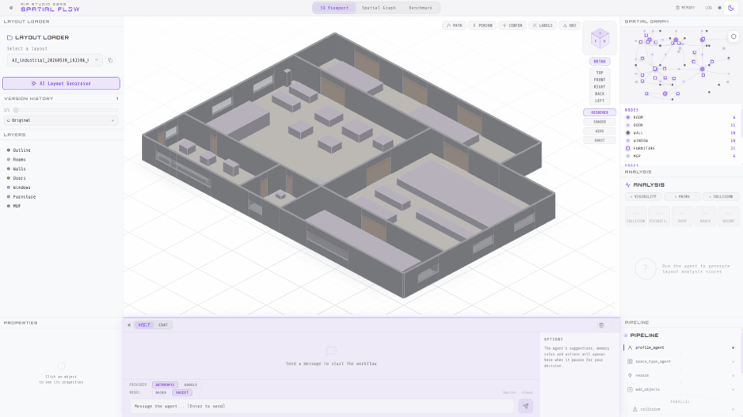

# Team 03 — Industrial Spatial Flow Agent

<p align="center">
  
</p>

An AI agent that optimizes **industrial** floor plan layouts by placing equipment and analyzing spatial quality against OSHA, NFPA, and ISO standards. It connects a Python LangGraph pipeline to a Grasshopper/Rhino simulation backend via MCP (Model Context Protocol), using Swiftlet as the MCP server.

**Scope: industrial only** — factories, workshops, warehouses, assembly halls, fabrication areas, clean rooms.

---

## Table of Contents

- [Requirements](#requirements)
- [Setup](#setup)
- [How to Run](#how-to-run)
- [Web Interface (AGENT\_ui)](#web-interface-agent_ui)
- [Graph Visualizer](#interactive-graph-visualizer)
- [Reference Commands](#reference-commands)
- [What the Agent Does](#what-the-agent-does)
- [Analysis Pipeline](#analysis-pipeline)
- [Memory & User Rules](#memory--user-rules)
- [Industrial Profiles](#industrial-profiles)
- [Known Issues](#known-issues)
- [File Structure](#file-structure)

---

## Web Interface (AGENT\_ui)

<p align="center">
  
</p>

A full-stack web app for chatting with the agent, visualizing layouts in 3D, and reviewing analysis results — all in real time.

**Stack:** React 19 + Three.js frontend · FastAPI + WebSocket backend · LangGraph pipeline · pure-Python spatial analysis (no Rhino required for visibility/path/observer tools)

### Key features

- Natural language chat wired to the real LangGraph pipeline
- Interactive 3D viewport with layer toggles (BEFORE / AFTER / collision / visibility / paths)
- Pipeline panel showing live node progress
- Draggable observer point (1.7 m person) synced with Grasshopper
- Provider + model selector (Anthropic Haiku/Sonnet · Google Gemini Flash/Pro) switchable at runtime
- AI Layout Generator (Sonnet) — generates floor plans from a brief, saves accepted plans
- Benchmark dashboard — records every pipeline run, compares models across score and timing
- 3D model export (OBJ + MTL ZIP) of the current visible layers
- Onboarding flow (user profile + space profile)

### Stress test

<p align="center">
  <video src="media/stress_test.mp4" controls width="100%"></video>
</p>

### How to run

Backend (port 3000):

```bash
cd team_03/AGENT_ui/backend
pip install -r requirements.txt
python server.py
```

Frontend (port 5173):

```bash
cd team_03/AGENT_ui/frontend
npm install
npm run dev
```

Then open **http://localhost:5173**

> API calls from the frontend are proxied automatically to the backend on port 3000.
> Swiftlet/Rhino does **not** need to be running for the spatial assistant (observer, visibility, path analysis) — those run in pure Python. Rhino is only needed for `place_objects` and Grasshopper-backed simulation tools.

---

## Requirements

- Python 3.10+
- Rhino 8 with Swiftlet installed (for Grasshopper tools)
- An LLM provider configured (Anthropic, OpenAI, Google, or local)

### Install dependencies

```bash
pip install langchain-openai langchain-anthropic langgraph grandalf shapely httpx python-dotenv anthropic networkx matplotlib
```

---

## Setup

### 1. `.env` file at the repository root

```env
LLM_PROVIDER=anthropic            # openai | anthropic | local | google | cloudflare
ANTHROPIC_MODEL=claude-haiku-4-5  # default model (cheapest)
REQUEST_TIMEOUT_SECONDS=300       # important: GH simulations can take >2 min
MAX_ITERATIONS=100
DEBUG_GRAPH=false
# LAYOUT_FILE=industrial_005      # alternative to --layout flag
```

### 2. `mcp.json` file at the repository root

```json
{
  "mcpServers": {
    "Swiftlet": {
      "command": "C:\\Users\\gramo\\AppData\\Roaming\\McNeel\\Rhinoceros\\packages\\8.0\\swiftlet\\0.2.0\\SwiftletBridge.exe",
      "args": ["http://localhost:3002/mcp/"]
    }
  }
}
```

### 3. Start Swiftlet in Rhino 8

Swiftlet must be running **before** launching `main.py`. Open Rhino 8, load `gh/team_03_working.gh`, and make sure Swiftlet is active on port 3002.

---

## How to Run

```bash
cd team_03/python

# Place equipment in an industrial layout
python main.py --layout industrial_005 "place a cnc machine in the workshop"

# Explicit prompt flag
python main.py --layout industrial_005 --prompt "check visibility in the fabrication hall"

# Forklift path
python main.py --layout industrial_03 "place a forklift path through the loading bay"

# Populate an empty layout (triggers the Populate Agent)
python main.py --layout industrial_005 "populate the workshop"

# Layout via environment variable
LAYOUT_FILE=industrial_005 python main.py "analyse the workshop clearances"

# Smoke test (no Rhino needed)
python test_bootstrap.py --layout industrial_005
```

### Orchestrator mode (subprocess CLI)

```bash
python main.py --prompt "add a window to the south wall" \
               --layout_json '{ "layoutId": "Layout-101", "rooms": [...], ... }'
```

Output includes parseable markers:

```
Final Response:
<agent response>

Edited Layout JSON:
<edited layout as JSON, or "No layout changes">
```

---

## Interactive Graph Visualizer

Live HTML visualization of the spatial graph. No server framework required. Runs at `http://127.0.0.1:7477`.

```bash
cd team_03/python

python visualize_interactive.py --session     # live workspace (with placed furniture)
python visualize_interactive.py industrial_03 # specific layout
python visualize_interactive.py --open        # reuse existing HTML

# Static version (matplotlib, no browser)
python test_spatial_graph.py --session
```

---

## Reference Commands

### Checkpoint — during an agent session

| Command | Action |
|---------|--------|
| `1` | Show BEFORE layout |
| `2` | Show AFTER layout |
| `3` | Show collision analysis |
| `4` | Show visibility analysis |
| `5` | Show paths |
| `0` | Clear all overlays |
| `s1`–`s5` | Agent smart suggestions |
| `rule: <text>` | Add a binding user rule |
| `forget: <n\|text\|all>` | Remove rule(s) |
| `rules` / `mem` | List active rules |
| Enter (empty) | Approve layout → save output |
| any text | Continue iterating with new instructions |

---

## What the Agent Does

1. **Receives** a natural-language prompt with an industrial layout instruction.
2. **Profile Agent** — detects the movement profile from the prompt (forklift, worker, crane...).
3. **Space Type Agent** — detects the industrial subtype (workshop, warehouse, assembly...).
4. **Populate Agent** (optional) — if the prompt contains `populate` / `fill` / `generate layout`, splits the space into functional zones and fills each one.
5. **Reason** — the LLM decides whether to place objects, call tools, or query.
6. **Parallel analysis** (5 tools):
   - Collision (BFS grid, 0.10 m resolution)
   - Visibility (isovist + sightlines, 72 rays)
   - Paths (BFS room-level + A* with furniture)
   - Ergonomic reachability
   - Object orientation
7. **Spatial graph** — a NetworkX MultiGraph gives the LLM pre-computed topology instead of raw JSON, and generates auto-correction vectors (`move [+0.9,+0.4] 0.4m to fix clearance`).
8. **Scoring** — weighted 0–100 score with letter grade A–F.
9. **Checkpoint** — user approves or continues iterating.
10. **Output** — saves the final layout to `output/<layoutId>_<timestamp>_final.json`.

### Standards applied

- **OSHA** — aisle widths, emergency egress
- **NFPA 101** — egress requirements
- **ISO 13857** — machinery guards
- **ANSI B56.1** — forklift specifications
- **ISO 11228** — ergonomic reach

---

## Analysis Pipeline

| Tool | Weight | Description |
|------|--------|-------------|
| Collision | 0.30 | BFS grid, real clearance via Voronoi boundary method |
| Visibility | 0.20 | Isovist + sightlines from each `use_point` |
| Path Analysis | 0.25 | BFS (no furniture) / A* (with furniture) |
| Reachability | 0.15 | Ergonomic reach envelope |
| Orientation | 0.10 | Object facing-direction check |

**Scoring:** A ≥ 90, B ≥ 75, C ≥ 60, D ≥ 40, F < 40. Structural violations penalized at 20% (not actionable); furniture/MEP violations at 100% (actionable).

---

## Memory & User Rules

Per-layout durable memory is persisted to `team_03/memory/<layout_name>.md` (gitignored).

| Kind | Heading | Behavior |
|------|---------|----------|
| **User Rules** (binding) | `## User Rules` | Protected — never reworded or dropped by the LLM |
| **Distilled facts** (soft) | `## Preferences`, `## Decisions`... | Auto-distilled from each user message |

The agent recalls rules and preferences across sessions for the same layout.

---

## Industrial Profiles

| Profile | Min path (m) | Turning radius (m) |
|---------|-------------|-------------------|
| standard_worker | 0.90 | 0.60 |
| forklift | 3.05 | 2.50 |
| crane | 5.00 | 5.00 |
| pallet_jack | 1.50 | 1.50 |
| maintenance_worker | 0.90 | 0.60 |

---

## Known Issues

1. **MCP tool call timeout** — Use `REQUEST_TIMEOUT_SECONDS=300` or higher. If it times out, check Rhino for red/orange GH components.
2. **`set_viewport` stays "pending"** — Has a 10s timeout with automatic fallback to `collision-detector-grid`.
3. **Viewport overlays not simultaneous** — Toggling to analysis views (3/4/5) may show only the analysis layer. Workaround: overlays use `collision-detector-grid` as base.

---

## File Structure

```
team_03/
  README.md                       # This file
  CLAUDE.md                       # Full technical documentation
  media/                          # GIFs and videos for this README
  python/
    main.py                       # CLI entry point
    graph.py                      # LangGraph StateGraph
    spatial_graph.py              # NetworkX spatial relationship graph
    visualize_interactive.py      # Live HTML visualizer (port 7477)
    nodes/                        # All pipeline nodes
    knowledge/                    # OSHA / NFPA / ISO knowledge base
    _runtime/                     # Bootstrap, LLM, MCP client, session
  layout/
    industrial_100/               # Industrial layouts (in scope)
  workspace/
    session_active.json           # Live session state (ephemeral)
  memory/
    <layout_name>.md              # Per-layout durable memory (gitignored)
  output/                         # Timestamped final layouts
  gh/
    team_03_working.gh            # Grasshopper definition
    set_viewport.py               # GHPython viewport toggle script
    set_observer.py               # GHPython observer point script
  AGENT_ui/                       # Full-stack web UI (see AGENT_ui/CLAUDE.md)
```

---

> For full technical documentation (architecture, layout schema, MCP tools, GHPython scripts), see [`CLAUDE.md`](CLAUDE.md).
