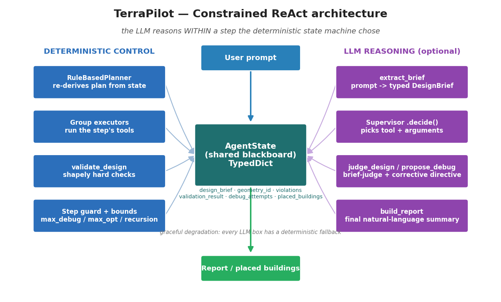
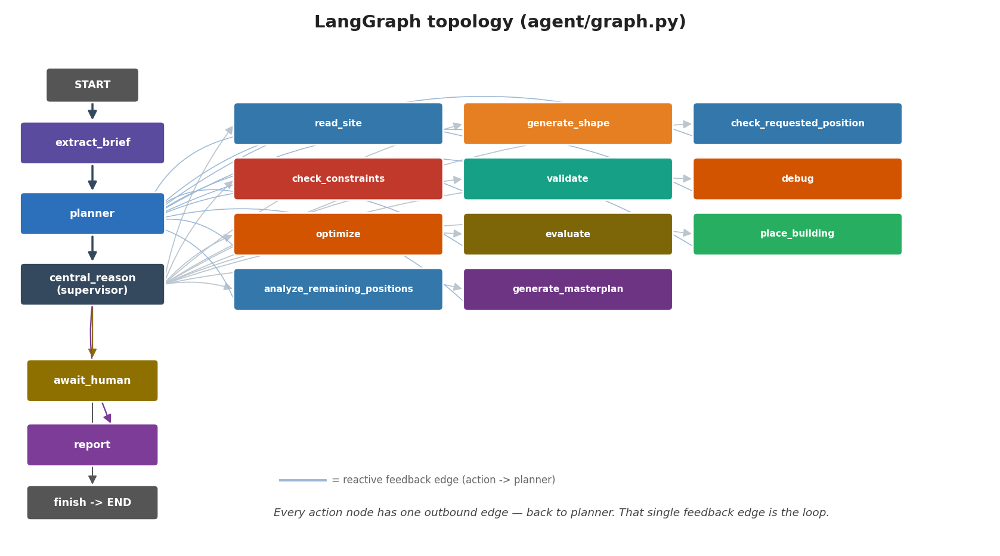
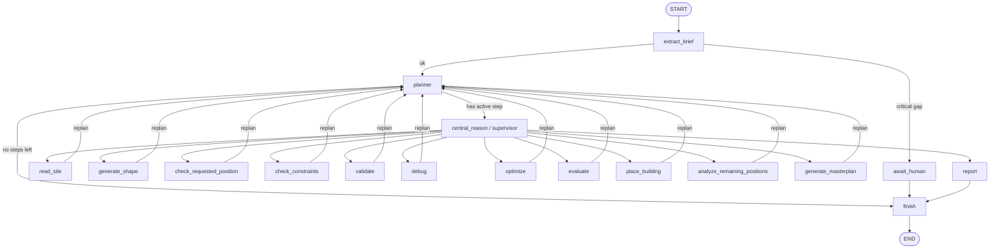
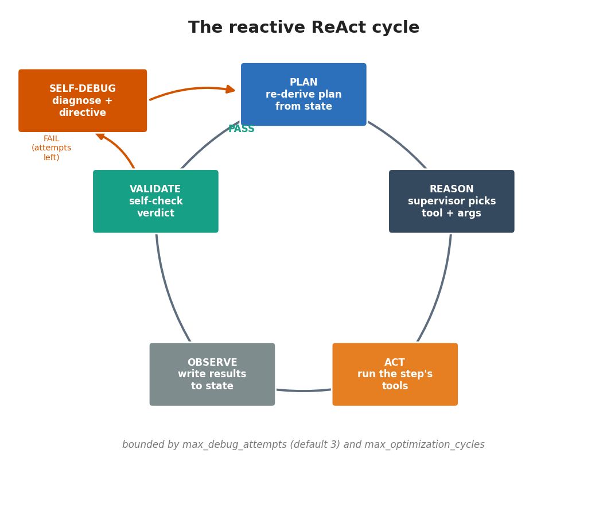
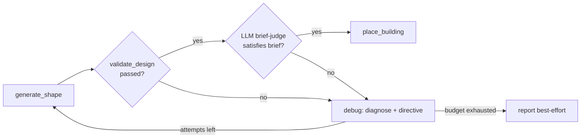
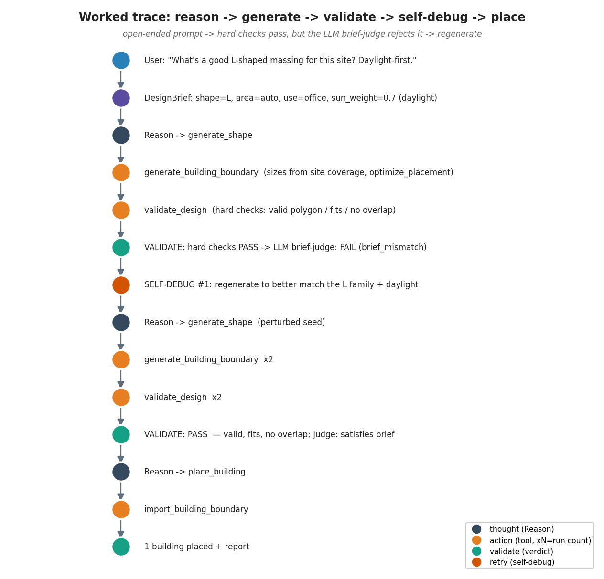
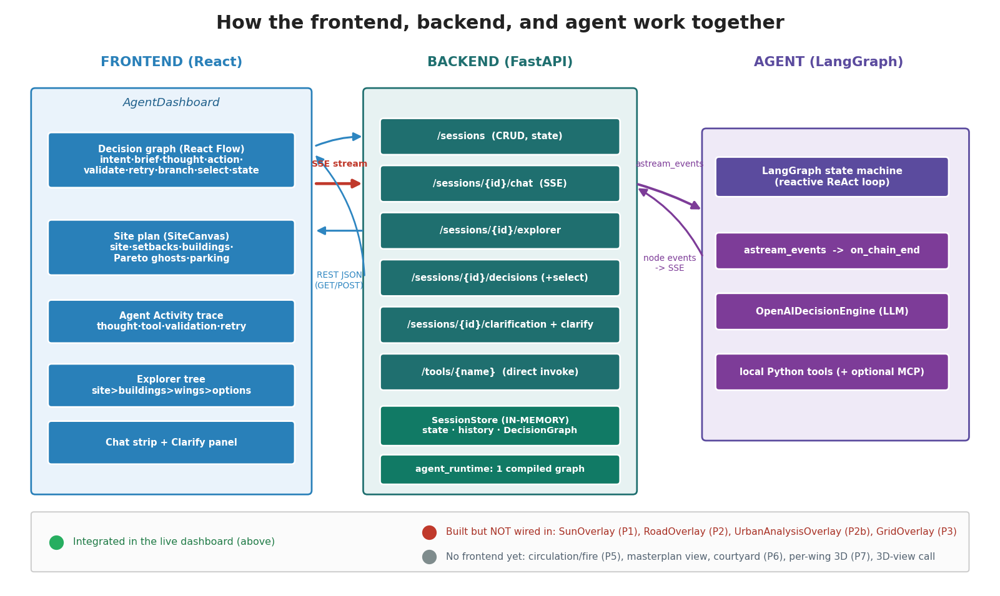

# TerraPilot — Agent Presentation

> A deep, accurate walkthrough of Team 04's site-planning agent: what it is, how
> its logic works, how it is designed, and **why** it is designed that way.
>
> Every claim here is traceable to source: [agent/graph.py](agent/graph.py),
> [agent/decision_engine.py](agent/decision_engine.py), [agent/state.py](agent/state.py),
> [agent/models.py](agent/models.py), [agent/tool_catalog.py](agent/tool_catalog.py),
> [agent/brief.py](agent/brief.py), [agent/tools/validate_design.py](agent/tools/validate_design.py),
> and [backend/routers/chat.py](backend/routers/chat.py).

---

## How to use this document

It is written as a **slide-by-slide script**. Each `##` section is one slide:
a title, the image/diagram to show, the talking points, and (where useful) the
exact file the claim comes from. Suggested order for a ~10–12 minute talk:

1. The problem → 2. The big idea → 3. Architecture → 4. The LangGraph →
5. The ReAct loop → 6. Self-validation & self-debug → 7. Worked trace (demo) →
8. Comprehension layer → 9. Tools → 10. Observability →
11. System shape (backend ⇄ frontend) → 12. How the backend works →
13. Frontend: what's wired in → 14. Frontend: what's not wired in yet →
15. Design rationale → 16. Limits & roadmap.

Diagrams live in [`presentation_images/`](presentation_images/) (PNGs, for slides)
and are *also* embedded as Mermaid (renders live in GitHub / VS Code).

---

## 1. The problem

Early architectural **massing** is inherently iterative: you place a building,
check whether it fits the site and the rules, and fix it when it doesn't. A
single-shot LLM can *describe* a footprint, but it cannot **guarantee** that the
footprint is a valid polygon, sits inside the site boundary, and doesn't overlap
other buildings.

**The bar TerraPilot has to clear:** produce a footprint you can trust, and
*correct itself* when the first attempt is wrong — without ever running forever.

---

## 2. The big idea

TerraPilot is a **reactive ReAct loop**, not a one-shot generator
([agent.md](agent.md)). Each design step runs as
**reason → act → observe → validate → (debug → retry)**:

- the **planner re-derives the next step from state after every action**,
- a **supervisor** reasons about which tool to call,
- a dedicated **`validate` step verifies the agent's own output** before anything
  is placed, and
- on failure the agent **debugs itself** — it diagnoses *why*, issues a
  corrective directive, and regenerates — bounded so a hopeless candidate still
  terminates with a report.

The one-sentence headline for the talk:

> **The LLM reasons *within* a step that a deterministic state machine chose — so
> the agent is flexible where it helps and predictable where it matters.**

---

## 3. Architecture — deterministic control vs. LLM reasoning



Everything flows through **one shared, typed `AgentState`** (a `TypedDict` in
[agent/state.py](agent/state.py)) — a *blackboard*. Nodes never call each other
directly; they only read and write this state.

Two kinds of nodes operate on it:

| Layer | Decided by | Where | Property it buys |
|---|---|---|---|
| **Control** (what step is next, run tools, hard-validate, enforce bounds) | Deterministic code | `RuleBasedPlanner`, group executors, `validate_design` | bounded, testable, terminating |
| **Reasoning** (which tool + arguments, judge the brief, write the directive, write the report) | LLM | `OpenAIDecisionEngine.decide / judge_design / propose_debug / extract_brief / build_report` | language-driven flexibility |

**Why this split is the whole point:** the LLM cannot invent or reorder control
flow. It fills in *judgement* (which tool, what arguments, does this match the
brief) inside a skeleton the state machine owns. That is what makes the output
trustworthy and the system unit-testable with **no LLM at all**.

> Speaker note: also point out *graceful degradation* — every LLM box has a
> deterministic fallback (regex brief, heuristic debug directive, deterministic
> step decisions), so the agent still runs offline / in CI / with a dead API key.

---

## 4. The LangGraph — actual nodes and edges



This is the compiled graph built in
[`build_agent_graph`](agent/graph.py) (a LangGraph `StateGraph`). The flow:

- `START → extract_brief` (comprehend the prompt once).
- `extract_brief →` either `await_human` (if a critical field is missing and
  clarification was requested) or `planner`.
- `planner →` `central_reason` (if there's a pending step) or `finish`.
- `central_reason →` exactly one action node (it routes on
  `state["current_action"]`).
- **Every action node has a single outbound edge: back to `planner`.**
- `report` and `await_human → finish → END`.



**The thing to point at:** that fan of edges back to `planner`
([agent/graph.py](agent/graph.py), the loop over node names) *is* the agent's
loop. There are no node→node shortcuts. Termination is guaranteed by a
`recursion_limit` (default **128**) plus the explicit bounds below.

---

## 5. The reactive ReAct loop



Mapping the classic ReAct pattern onto the real nodes:

| ReAct phase | In TerraPilot | Implementation |
|---|---|---|
| **Plan** | `planner` re-derives the plan from current state | `RuleBasedPlanner.build_plan()` |
| **Reason** | `central_reason` supervisor picks the tool + arguments | `OpenAIDecisionEngine.decide()` |
| **Act** | the action node runs that step's tools | group-executor nodes |
| **Observe** | the node writes results into state, sets `replan_required` | every action node |
| **Validate** | `validate` produces a pass/fail verdict | `validate_design` + LLM judge |
| **Self-debug** | `debug` diagnoses and rewrites the next attempt | `propose_debug` / heuristic |

**What makes it *reactive* (not a fixed script):** the planner recomputes each
step's status (`pending` / `completed` / `skipped`) **from live state every
pass**. So the plan responds to what tools return:

- constraint **violations** → `optimize` becomes pending,
- a failed **verdict** → `debug` becomes pending,
- a placed building when more are needed → `generate_shape` becomes pending again.

> Be precise on stage (a sharp reviewer will ask): the *ordering* of steps is a
> fixed sequence; reactivity comes from **state-derived statuses + the loop-back
> edge**, not from the LLM freely reordering steps. That is a deliberate
> trade-off — open-ended autonomy traded for guaranteed termination and
> testability.

---

## 6. Self-validation & self-debug (the trust mechanism)

This is the most important technical slide — it's what separates TerraPilot from
"an LLM that emits a shape."

**`validate` node** ([agent/graph.py](agent/graph.py),
[agent/tools/validate_design.py](agent/tools/validate_design.py)) runs
deterministic `shapely` checks:

| Check | Failure token | Detail |
|---|---|---|
| `valid_polygon` | `invalid_polygon` | closed, non-self-intersecting |
| `fits_site` | `outside_site` | < 0.5 % / 0.5 m² spill treated as numerical noise |
| `no_overlap` | `overlap` | vs. already-placed buildings |
| `area_within_tolerance` | `area` | only when a target area is known; default tolerance **±25 %** |

If (and only if) the hard checks pass, an **optional LLM brief-judge**
(`judge_design`) answers the softer question — *does this footprint actually
satisfy the brief?* A passing verdict **gates placement**; a failing one makes
the planner schedule `debug`.

**`debug` node** ([agent/graph.py](agent/graph.py)):
- asks `propose_debug` (LLM) for a one-line **corrective directive**, or falls
  back to a heuristic failure→fix map when no LLM is available;
- **clears the rejected geometry** so `generate_shape` runs again;
- increments `debug_attempts`, bounded by `max_debug_attempts` (**default 3**).

On the retry, the shape repair layer **perturbs the random seed** by
`debug_attempts * 1009` ([agent/decision_engine.py](agent/decision_engine.py)),
so regeneration explores a *different* candidate instead of reproducing the
rejected one — and the directive is fed verbatim into the next supervisor call.



---

## 7. Worked trace (use this as the live demo)



An **open-ended, qualitative prompt** is the best showcase of how the agent
*reacts*: the geometry can be perfectly valid and still not be a *good* answer —
exactly what the LLM brief-judge is there to catch.

```
intent → brief (shape=L, area=auto, daylight-first)
       → reason → generate_building_boundary → validate_design
       → VALIDATE: hard checks PASS → LLM brief-judge: FAIL (brief_mismatch)
       → SELF-DEBUG #1: regenerate to better match the L family + daylight
       → reason → generate_building_boundary ×2 → validate_design ×2
       → VALIDATE: PASS  (valid, fits, no overlap; judge: satisfies brief)
       → reason → import_building_boundary → 1 building placed + report
```

**Two failure modes drive the self-correction loop:**
- **Hard-check failure** — deterministic `validate_design`: `invalid_polygon` /
  `outside_site` / `overlap` / `area`.
- **Soft brief failure** — the LLM judge: geometry is valid but doesn't satisfy the
  brief → `brief_mismatch` (the mode shown above, and the right one for a
  subjective prompt). *The judge needs a configured LLM; without one the agent
  still runs every hard check.*

**Bounded-termination proof — verified.** Running
[`test_notebooks/_smoke_validate.py`](test_notebooks/_smoke_validate.py) with
`validate` forced to always fail produces `generate ×3, validate ×3,
debug_attempts = 2 (the cap), placed = 0 — and it still emits a report`. The happy
path in the same run places **1 building with debug_attempts = 0**. Reactivity
*and* graceful termination, demonstrated deterministically (no LLM required).

> Run the loop live: [`test_notebooks/test_decision_graph.ipynb`](test_notebooks/test_decision_graph.ipynb)
> renders it with a step-by-step replay animation.

---

## 8. The comprehension layer (Phase 0)

Before any loop runs, `extract_brief` ([agent/graph.py](agent/graph.py)) turns
the free-text prompt into a **typed `DesignBrief`**
([agent/models.py](agent/models.py)) so the agent reasons over a *structure*, not
the raw string, and never re-parses the prompt at every step.

A `DesignBrief` carries: `building_count`, a `BuildingSpec` per building
(`shape_preference` ∈ `{I, L, T, U, H, Y, X, O, auto}`, `footprint_area_sqm`,
`storeys`, `use`, `intent_text`), `courtyard_requested`, `parking_requested`,
`requested_rotation_deg`, objective weights (`view` / `sun` / `alignment`), and
explicit `ambiguities` (what it could *not* infer, rather than guessing).

- **LLM extractor** when available (`OpenAIDecisionEngine.extract_brief`);
- **regex fallback** otherwise ([agent/brief.py](agent/brief.py)), so it works
  with no network.
- If a placement-critical field is missing and interactive clarification is
  enabled, it routes to `await_human` instead of guessing.

---

## 9. Tools

Tools are grouped by the action that uses them
([agent/tool_catalog.py](agent/tool_catalog.py)). When the supervisor reasons
about a step, it sees **only that step's tools** — smaller prompt, no cross-talk,
and new tools slot in by editing one map.

| Action | Tool group (representative tools) |
|---|---|
| `read_site` | `analyze_site_boundary`, context / legal readers |
| `generate_shape` | `generate_building_boundary`, parametric shape generators |
| `check_constraints` | site-fit / setback / area / adjacency / tree checkers |
| `validate` | `validate_design` |
| `optimize` | boundary / wing / scale / rotate manipulators |
| `evaluate` | spatial-intention / performance / integrity evaluators |
| `place_building` | `import_building_boundary` |
| `analyze_remaining_positions`, `check_requested_position` | buildable-positions, requested-position, proximity |
| `generate_masterplan` | `generate_masterplan` |

Tools run as **local Python by default**, with **MCP / Grasshopper as an optional
downstream handoff** ([agent/main.py](agent/main.py),
[agent/mcp_client.py](agent/mcp_client.py)). Site-aware placement uses `pymoo`
when a site boundary is available.

**Three workflow modes** (the planner branches on `workflow_mode` in
[agent/decision_engine.py](agent/decision_engine.py)):
- `full` — the per-building generate → validate → place loop;
- `boundary_only` — produce a footprint candidate, skip placement;
- `masterplan` — whole-site: read site → `generate_masterplan` (circulation,
  fire, parking) → report.

---

## 10. Observability (it's not a black box)

The chat backend streams the agent's thinking live over Server-Sent Events
([backend/routers/chat.py](backend/routers/chat.py)), driven off each LangGraph
node's `on_chain_end`:

| Event | Meaning |
|---|---|
| `thought` | supervisor reasoning `{action, reasoning}` |
| `tool` / `tool_result` | a tool call and its outcome (with a running per-tool count) |
| `validation` | the self-validation verdict `{passed, failures, summary, metrics}` |
| `retry` | a self-debug attempt `{attempt, directive, diagnosis, failures}` |
| `state` / `clarify` / `done` / `error` | final state, clarification request, lifecycle |

The backend builds a live `DecisionGraph` (`make_thought_node` /
`make_validate_node` / `make_retry_node`) that the frontend renders as an Agent
Activity timeline ([frontend/dashboard/AgentDashboard.tsx](frontend/dashboard/AgentDashboard.tsx)).

> Demo value: the audience *watches* the agent reason, validate, and self-correct
> in real time — which is the most persuasive proof of the whole design.

---

## 11. System shape — backend ⇄ frontend



Three tiers, one rule: **the frontend never imports agent code — it only talks to
the backend over HTTP.**

- **React frontend** ([frontend/](frontend/)) — the `AgentDashboard` UI.
- **FastAPI backend** ([backend/app.py](backend/app.py)) — the *only* thing that
  talks to the agent.
- **LangGraph agent** ([agent/](agent/)) — the runtime from Part I.

Two transport styles carry two different kinds of information:

| Transport | Question it answers | Endpoints |
|---|---|---|
| **REST JSON** (GET/POST) | *what the agent has* | `/sessions`, `/explorer`, `/decisions`, `/clarification`, `/tools` |
| **SSE stream** (one long POST) | *what the agent is doing right now* | `/sessions/{id}/chat` |

---

## 12. How the backend works

A FastAPI app ([backend/app.py](backend/app.py)) mounts **six routers** (CORS open
for dev):

| Router | Responsibility |
|---|---|
| `sessions` | create / list / delete a session; read full `AgentState` + chat history |
| `chat` (SSE) | run the agent and stream the live ReAct trace |
| `explorer` | shape state into a UI tree — site, buildings, wings, options, parking |
| `decisions` | the reasoning DAG `{nodes, edges, head}` + option selection |
| `clarify` | the agent's ask-back question + answer submission |
| `tools` | direct, session-less invocation of any geometry tool |

Two supporting pieces:

- **SessionStore** ([backend/session_store.py](backend/session_store.py)) —
  **in-memory** (a dict behind an `asyncio.Lock`) holding each session's state,
  chat history, and `DecisionGraph`. *Sessions do not survive a server restart* —
  the code itself notes "Replace with Redis or a DB for production."
- **agent_runtime** ([backend/agent_runtime.py](backend/agent_runtime.py)) — builds
  **one** compiled LangGraph app for the whole process (LLM + tools + catalog),
  cached and thread-safe.

**A chat request, end to end** ([backend/routers/chat.py](backend/routers/chat.py)):
1. record the user message → emit an `intent` decision node;
2. `astream_events` the compiled graph;
3. translate each node's `on_chain_end` into SSE events (`thought`, `tool`,
   `tool_result`, `validation`, `retry`, `decision`, `clarify`) while growing a
   server-side `DecisionGraph`;
4. on completion, persist the final state + graph and emit `state` → `done`.

> Same `on_chain_end` mechanism as Slide 10, seen from the integration side: the
> backend is the **translator** between LangGraph internals and a UI-friendly
> event stream.

---

## 13. Frontend — what's wired into the live overview ✅

One screen — `AgentDashboard`
([frontend/dashboard/AgentDashboard.tsx](frontend/dashboard/AgentDashboard.tsx)) —
fed entirely by the real backend:

| Pane / feature | Backend it consumes | Status |
|---|---|---|
| **Decision graph** (React Flow) — renders every node type: `intent · brief · clarify · thought · action · validate · retry · branch · select · state` ([nodeTypes.ts](frontend/decision-graph/nodeTypes.ts)) | `GET /decisions` + live `decision` SSE | ✅ |
| **Agent Activity trace** — the reactive loop live: `thought · tool (+counts) · validation · retry` | `chat` SSE events | ✅ |
| **Site plan** (`SiteCanvas`) — boundary, buildable zone (setbacks), placed buildings coloured by family, Pareto ghost options, **parking zones (Phase 4)** | `GET /explorer` | ✅ |
| **Explorer tree** — site → buildings → wings → placement options | `GET /explorer`, `/buildings/{id}/options` | ✅ |
| **Chat + Clarify** — streaming chat; ask-back rendered as chips | `chat` SSE, `GET /clarification`, `POST /clarify` | ✅ |

**Headline:** the **entire reactive ReAct loop is visible** — both as live
Activity-trace rows *and* as typed nodes in the decision graph
(`thought → action → validate → retry`). The Phase-0 reasoning core and Phase-4
parking are integrated end to end.

---

## 14. Frontend — what's NOT wired in yet ⚠️ ❌

Be candid here; knowing your system's edges builds credibility.

**A. Built as components, but NOT mounted in the dashboard.** Each is written,
typed, contract-documented, and exported from [frontend/index.ts](frontend/index.ts)
— but `SiteCanvas` / `AgentDashboard` don't import them (verified by grep):

| Overlay | Phase | Backend tool ready | API client method |
|---|---|---|---|
| `SunOverlay` | 1 — sun | ✅ `/tools/sun_*` | ✅ `api.sunVectors / sunExposure / worstSunSide` |
| `RoadOverlay` | 2 — roads | ✅ `/tools/road_context` | ✅ `api.roadContext` |
| `UrbanAnalysisOverlay` | 2b — urban | ✅ `/tools/urban_analysis` | ✅ `api.urbanAnalysis` |
| `GridOverlay` | 3 — grid | ✅ `/tools/site_grid` | ✅ `api.siteGrid / alignedPlacement` |

→ Finishing these is a *composition* task: render the overlay inside `SiteCanvas`
and feed it the tool result. The hard parts (backend tool, types, contract,
client) already exist.

**B. No frontend representation yet** (backend / tools exist; nothing renders them):

- **Circulation & fire (Phase 5)** — `/tools/{site_entries, route_circulation, entrance_orientation, fire_access}` run, but there's no entries / route / fire-access overlay.
- **Masterplan** — the `masterplan` workflow + `/tools/generate_masterplan` produce a whole-site plan; its placed buildings + parking appear on `SiteCanvas` via the explorer, but there is **no dedicated masterplan view** (movement spine, scoring breakdown).
- **3D view analysis** — `GET /buildings/{id}/view` and `api.getBuildingView` exist, but the dashboard never invokes them (a building's `view_score` is shown if present; there's no 3D viewer).
- **Courtyard (P6), per-wing 3D height controls (P7), full pipeline animation (P8)** — not built.

> One line for the talk: *"Phase 0 reasoning and Phase 4 parking are integrated
> end-to-end; Phases 1–3 have UI components written but not yet mounted; Phases 5+
> are backend-only so far."*

---

## 15. Design rationale (the slide that wins technical audiences)

| Decision | Why this way | Alternative rejected |
|---|---|---|
| Deterministic planner; LLM only chooses tool + args | bounded, testable (tests run with **no** LLM), no hallucinated control flow, predictable cost | fully autonomous ReAct — unbounded, hard to test, can loop forever |
| Step status derived from state every pass | the plan *reacts* — violations → `optimize`, failed verdict → `debug` | a fixed linear script that ignores tool results |
| Self-validate **before** placing | nothing is placed unless it's a valid polygon, fits, no overlap, area in tolerance | trusting the generator blindly |
| Reasoned debug directive **+ perturbed seed** | retries change in a *diagnosed* direction and never reproduce the failure | naive "try again" with identical inputs |
| Bounded loops (`max_debug_attempts`, `max_optimization_cycles`, `recursion_limit`) | a hopeless candidate still terminates with a report | infinite correction loops |
| Step guard filters the LLM's action/tools | keeps the LLM on the active step | LLM drifting to the wrong tool |
| Graceful LLM degradation everywhere | runs offline / in CI / with a dead key | hard dependency on a live LLM |
| Shared typed blackboard (`AgentState`) | nodes stay decoupled; easy to add a node | tangled node-to-node calls |
| Stream every step to the UI | trust + debuggability | a black box that only emits a final answer |

---

## 16. Limits & roadmap (honesty earns trust)

- **Step ordering is fixed**, not LLM-chosen — reactivity is via state-derived
  statuses and the loop-back edge. This is intentional, but it's not open-ended
  autonomy.
- The **LLM brief-judge and debugger are optional**; without an LLM the agent
  uses the regex brief and a heuristic failure→fix map (still correct, less
  nuanced).
- **MCP / Grasshopper** remain integration *targets*; the clean, well-tested path
  today is the local Python tool surface ([agent.md](agent.md)).
- Output is written to
  [team_04_placement_result.json](team_04_placement_result.json) (final response,
  shape context, placement summaries, tool history).

---

## Appendix — anticipated Q&A

- **"Is it really agentic if the steps are fixed?"** — Yes, in the reactive
  sense: control flow responds to tool results (re-plan after every act, schedule
  `optimize`/`debug` from state). We constrained step *ordering* on purpose to
  guarantee termination and make it testable.
- **"What stops infinite loops?"** — `max_debug_attempts` (default 3),
  `max_optimization_cycles`, and a LangGraph `recursion_limit` (default 128).
- **"What if the LLM is down?"** — It degrades to deterministic parsing, decisions,
  and debug heuristics; the whole graph still runs (this is how the tests run).
- **"How do you know the output is valid?"** — `validate_design` runs hard
  `shapely` checks and gates placement; nothing is placed on a failing verdict.
- **"How do you add a new capability?"** — add the tool to a group in
  [agent/tool_catalog.py](agent/tool_catalog.py); the supervisor sees it on the
  relevant step automatically.

---

### Image index

| File | Use on slide |
|---|---|
| [`presentation_images/architecture.png`](presentation_images/architecture.png) | 3 — Architecture |
| [`presentation_images/langgraph_topology.png`](presentation_images/langgraph_topology.png) | 4 — LangGraph |
| [`presentation_images/react_loop.png`](presentation_images/react_loop.png) | 5 — ReAct loop |
| [`presentation_images/worked_trace.png`](presentation_images/worked_trace.png) | 7 — Worked trace / demo |
| [`presentation_images/backend_frontend_dataflow.png`](presentation_images/backend_frontend_dataflow.png) | 11 — System shape (backend ⇄ frontend) |
